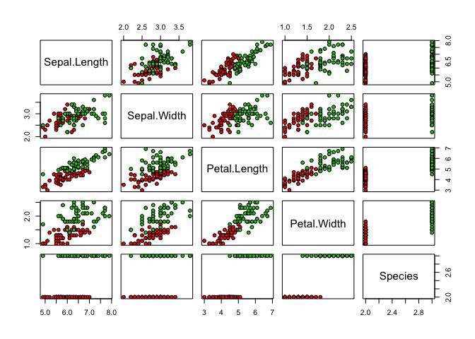

iris dataset exploration
================

## GitHub Documents

This is an R Markdown format used for publishing markdown documents to
GitHub. When you click the **Knit** button all R code chunks are run and
a markdown file (.md) suitable for publishing to GitHub is generated.

## Including Code

You can include R code in the document as follows:

``` r
library(caret)
```

    ## Loading required package: lattice

    ## Loading required package: ggplot2

``` r
data(iris)
iris <- iris[-which(iris$Species=='setosa'),]
y <- iris$Species
```

``` r
set.seed(2, sample.kind="Rounding")    # if using R 3.6 or later, use set.seed(2, sample.kind="Rounding")
```

    ## Warning in set.seed(2, sample.kind = "Rounding"): non-uniform 'Rounding'
    ## sampler used

``` r
test_index <- createDataPartition(y,times=1,p=0.5,list=FALSE)
```

    ## Warning in createDataPartition(y, times = 1, p = 0.5, list = FALSE): Some
    ## classes have no records ( setosa ) and these will be ignored

``` r
test <- iris[test_index,]
train <- iris[-test_index,]


cutoff <- seq(1, 10,0.1)
cutoff
```

    ##  [1]  1.0  1.1  1.2  1.3  1.4  1.5  1.6  1.7  1.8  1.9  2.0  2.1  2.2  2.3
    ## [15]  2.4  2.5  2.6  2.7  2.8  2.9  3.0  3.1  3.2  3.3  3.4  3.5  3.6  3.7
    ## [29]  3.8  3.9  4.0  4.1  4.2  4.3  4.4  4.5  4.6  4.7  4.8  4.9  5.0  5.1
    ## [43]  5.2  5.3  5.4  5.5  5.6  5.7  5.8  5.9  6.0  6.1  6.2  6.3  6.4  6.5
    ## [57]  6.6  6.7  6.8  6.9  7.0  7.1  7.2  7.3  7.4  7.5  7.6  7.7  7.8  7.9
    ## [71]  8.0  8.1  8.2  8.3  8.4  8.5  8.6  8.7  8.8  8.9  9.0  9.1  9.2  9.3
    ## [85]  9.4  9.5  9.6  9.7  9.8  9.9 10.0

``` r
#accuracy for sepal.Width
library(purrr)
```

    ## 
    ## Attaching package: 'purrr'

    ## The following object is masked from 'package:caret':
    ## 
    ##     lift

``` r
accuracy <- map_dbl(cutoff, function(x){
  y_hat <- ifelse(train$Sepal.Width > x, "virginica", "versicolor")
  mean(y_hat == train$Species)
})

max(accuracy)
```

    ## [1] 0.62

``` r
#accuracy for sepal.length

accuracy <- map_dbl(cutoff, function(x){
  y_hat <- ifelse(train$Sepal.Length > x, "virginica", "versicolor")
  
  mean(y_hat == train$Species)
})

max(accuracy)
```

    ## [1] 0.7

``` r
#accuracy for Petal.Width

accuracy <- map_dbl(cutoff, function(x){
  y_hat <- ifelse(train$Petal.Width > x, "virginica", "versicolor")
  mean(y_hat == train$Species)
})

max(accuracy)
```

    ## [1] 0.94

``` r
#accuracy for Petal.Length

accuracy <- map_dbl(cutoff, function(x){
  y_hat <- ifelse(train$Petal.Length > x, "virginica", "versicolor")
  mean(y_hat == train$Species)
})

max(accuracy)
```

    ## [1] 0.96

``` r
#applying the training cutoff for test data

best_cutoff <- cutoff[which.max(accuracy)]
best_cutoff
```

    ## [1] 4.7

``` r
y_hat <- ifelse(test$Petal.Length > best_cutoff, "virginica", "versicolor") 

mean(y_hat == test$Species)
```

    ## [1] 0.9

``` r
#lets do some data exploratory analysis

plot(iris,pch=21,bg=iris$Species)
```

<!-- -->
