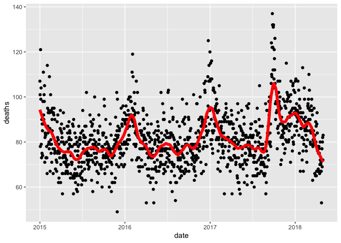
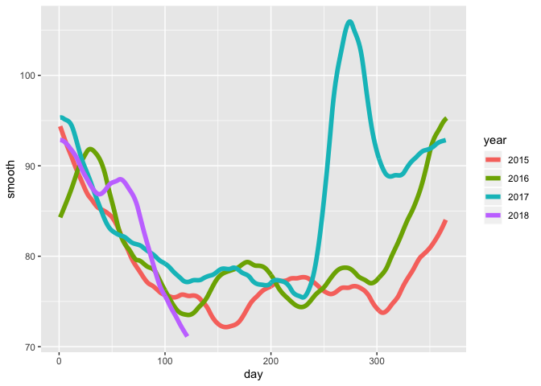

loess function
================

## Code for loess function example

You can include R code in the document as
    follows:

``` r
library(tidyverse)
```

    ## ── Attaching packages ─────────────────────────────────────────────────── tidyverse 1.3.0 ──

    ## ✔ ggplot2 3.2.1     ✔ purrr   0.3.3
    ## ✔ tibble  3.0.1     ✔ dplyr   1.0.0
    ## ✔ tidyr   1.0.2     ✔ stringr 1.4.0
    ## ✔ readr   1.3.1     ✔ forcats 0.4.0

    ## Warning: package 'tibble' was built under R version 3.6.2

    ## Warning: package 'dplyr' was built under R version 3.6.2

    ## ── Conflicts ────────────────────────────────────────────────────── tidyverse_conflicts() ──
    ## ✖ dplyr::filter() masks stats::filter()
    ## ✖ dplyr::lag()    masks stats::lag()

``` r
library(lubridate)
```

    ## Warning: package 'lubridate' was built under R version 3.6.2

    ## 
    ## Attaching package: 'lubridate'

    ## The following objects are masked from 'package:base':
    ## 
    ##     date, intersect, setdiff, union

``` r
library(purrr)
library(pdftools)
```

    ## Warning: package 'pdftools' was built under R version 3.6.2

    ## Using poppler version 0.73.0

``` r
fn <- system.file("extdata", "RD-Mortality-Report_2015-18-180531.pdf", package="dslabs")
dat <- map_df(str_split(pdf_text(fn), "\n"), function(s){
  s <- str_trim(s)
  header_index <- str_which(s, "2015")[1]
  tmp <- str_split(s[header_index], "\\s+", simplify = TRUE)
  month <- tmp[1]
  header <- tmp[-1]
  tail_index  <- str_which(s, "Total")
  n <- str_count(s, "\\d+")
  out <- c(1:header_index, which(n==1), which(n>=28), tail_index:length(s))
  s[-out] %>%
    str_remove_all("[^\\d\\s]") %>%
    str_trim() %>%
    str_split_fixed("\\s+", n = 6) %>%
    .[,1:5] %>%
    as_data_frame() %>% 
    setNames(c("day", header)) %>%
    mutate(month = month,
           day = as.numeric(day)) %>%
    gather(year, deaths, -c(day, month)) %>%
    mutate(deaths = as.numeric(deaths))
}) %>%
  mutate(month = recode(month, "JAN" = 1, "FEB" = 2, "MAR" = 3, "APR" = 4, "MAY" = 5, "JUN" = 6, 
                        "JUL" = 7, "AGO" = 8, "SEP" = 9, "OCT" = 10, "NOV" = 11, "DEC" = 12)) %>%
  mutate(date = make_date(year, month, day)) %>%
  filter(date <= "2018-05-01")
```

    ## Warning: `as_data_frame()` is deprecated as of tibble 2.0.0.
    ## Please use `as_tibble()` instead.
    ## The signature and semantics have changed, see `?as_tibble`.
    ## This warning is displayed once every 8 hours.
    ## Call `lifecycle::last_warnings()` to see where this warning was generated.

    ## Warning: The `x` argument of `as_tibble.matrix()` must have column names if `.name_repair` is omitted as of tibble 2.0.0.
    ## Using compatibility `.name_repair`.
    ## This warning is displayed once every 8 hours.
    ## Call `lifecycle::last_warnings()` to see where this warning was generated.

``` r
span <- 60 / as.numeric(diff(range(dat$date)))
fit <- dat %>% mutate(x = as.numeric(date)) %>% loess(deaths ~ x, data = ., span = span, degree = 1)
```

## plots for smoothing

    ## Warning: Removed 1 rows containing missing values (geom_point).

<!-- --><!-- -->

Note that the `echo = FALSE` parameter was added to the code chunk to
prevent printing of the R code that generated the plot.
