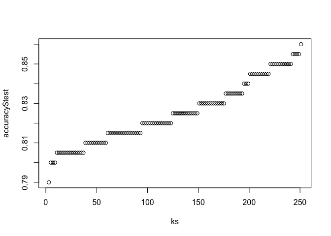

knn algorithm vs logistic regression
================

## code for knn algorithm.

You can include R code in the document as
    follows:

``` r
library(tidyverse)
```

    ## ── Attaching packages ─────────────────────────────────────────────────── tidyverse 1.3.0 ──

    ## ✔ ggplot2 3.2.1     ✔ purrr   0.3.3
    ## ✔ tibble  3.0.1     ✔ dplyr   1.0.0
    ## ✔ tidyr   1.0.2     ✔ stringr 1.4.0
    ## ✔ readr   1.3.1     ✔ forcats 0.4.0

    ## Warning: package 'tibble' was built under R version 3.6.2

    ## Warning: package 'dplyr' was built under R version 3.6.2

    ## ── Conflicts ────────────────────────────────────────────────────── tidyverse_conflicts() ──
    ## ✖ dplyr::filter() masks stats::filter()
    ## ✖ dplyr::lag()    masks stats::lag()

``` r
library(dslabs)
library(caret)
```

    ## Loading required package: lattice

    ## 
    ## Attaching package: 'caret'

    ## The following object is masked from 'package:purrr':
    ## 
    ##     lift

``` r
data("mnist_27")
```

``` r
#make the predictors (features) as matrix
x <- as.matrix(mnist_27$train[,2:3])
#make outcomes as a vector
y <- mnist_27$train$y
#one way to call knn 
#another way to call knn
k<-1

#train_fitt and accuracy -- this is not required but just to show the sample
knn_fit <- knn3(y ~ ., data = mnist_27$train, k=k)

y_hat_knn<-predict(knn_fit, mnist_27$train, type = "class")
train_accuracy<-confusionMatrix(data = y_hat_knn, reference = mnist_27$train$y)$overall["Accuracy"]
k
```

    ## [1] 1

``` r
train_accuracy
```

    ## Accuracy 
    ##   0.9975

``` r
#test_fitting and accuracy
knn_fit <- knn3(y ~ ., data = mnist_27$train, k=k)

y_hat_knn<-predict(knn_fit, mnist_27$test, type = "class")
length(y_hat_knn)
```

    ## [1] 200

``` r
length(mnist_27$test$y)
```

    ## [1] 200

``` r
k
```

    ## [1] 1

``` r
test_accuracy<-confusionMatrix(data = y_hat_knn, reference = mnist_27$test$y)$overall["Accuracy"]
test_accuracy
```

    ## Accuracy 
    ##    0.735

``` r
k<-401

#train_fitt and accuracy -- this is not required but just to show the sample
knn_fit <- knn3(y ~ ., data = mnist_27$train, k=k)

y_hat_knn<-predict(knn_fit, mnist_27$train, type = "class")
train_accuracy<-confusionMatrix(data = y_hat_knn, reference = mnist_27$train$y)$overall["Accuracy"]
k
```

    ## [1] 401

``` r
train_accuracy
```

    ## Accuracy 
    ##  0.81375

``` r
#test_fitting and accuracy
knn_fit <- knn3(y ~ ., data = mnist_27$train, k=k)

y_hat_knn<-predict(knn_fit, mnist_27$test, type = "class")
length(y_hat_knn)
```

    ## [1] 200

``` r
length(mnist_27$test$y)
```

    ## [1] 200

``` r
k
```

    ## [1] 401

``` r
test_accuracy<-confusionMatrix(data = y_hat_knn, reference = mnist_27$test$y)$overall["Accuracy"]
test_accuracy
```

    ## Accuracy 
    ##     0.79

``` r
#pick the k in knn
ks <- seq(3, 251, 2)
library(purrr)
accuracy <- map_df(ks, function(k){
    fit <- knn3(y ~ ., data = mnist_27$train, k = k)
    y_hat <- predict(fit, mnist_27$train, type = "class")
    cm_train <- confusionMatrix(data = y_hat, reference = mnist_27$train$y)
    train_error <- cm_train$overall["Accuracy"]
    y_hat <- predict(fit, mnist_27$test, type = "class")
    cm_test <- confusionMatrix(data = y_hat, reference = mnist_27$test$y)
    test_error <- cm_test$overall["Accuracy"]
    
tibble(train = train_error, test = test_error)
    })


#pick the k that maximizes accuracy using the estimates built on the test data
ks[which.max(accuracy$test)]
```

    ## [1] 41

``` r
max(accuracy$test)
```

    ## [1] 0.86

``` r
qqplot(ks,accuracy$test)
```

<!-- -->

Note that the `echo = FALSE` parameter was added to the code chunk to
prevent printing of the R code that generated the plot.
